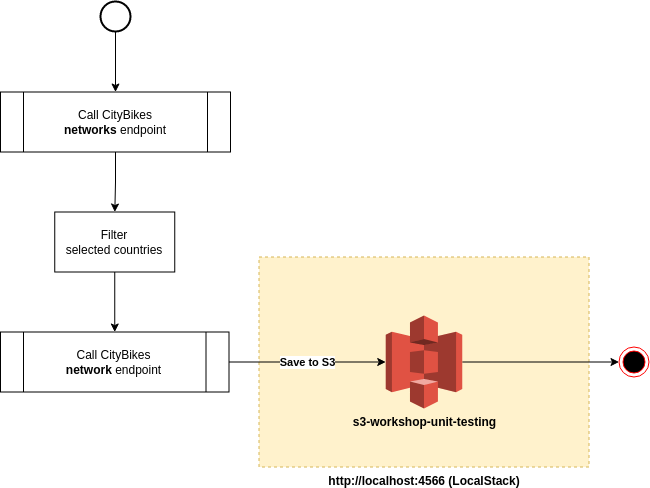

# Solution overview



# How to execute

## Requisites

- Docker (https://docs.docker.com/engine/install/)
- Python (at least 3.8)
- GNU Make (default Linux/macOS)

### Setting up

- Clone the repository
- cd workshop-unit-testing
- python3 -m venv .venv
- source .venv/bin/activate
- make install

Note: Always be sure that IDE is using the virtual env (.venv) and not your system default python.

### Running it locally
- Be sure the virtual env (.venv) is activated
- make run

To execute it through IDE, make the `app` folder available inside `PYTHONPATH` variable. Using PyCharm, you can
right-click `app` folder > Mark Directory as > Sources Root. The folder icon will be displayed in blue color.

The script to be executed is `main.py` and if everything is running successfully, after executing the script you will be
able to download the file from local S3 by pasting the following URL into your browser:

`http://localhost:4566/s3-workshop-unit-testing/[here-you-paste-the-object-key]`

The script will provide a log line `main: file uploaded {url}` once clicked will download the file

### Running all unit tests

- Be sure the virtual env (.venv) is activated
- make unit-tests

# Challenge

Everything seems to be working, right? But if I tell you there are things missing...

## First problem

The `city_bikes_test.py` checks if the function's content was returned successfully, but it's missing the most crucial
thing, which is to validate that the `requests.get` is sent as expected.

For the following code, you need to ensure that the function will
call `http://api.citybik.es/v2/networks?fields=id,location.country` endpoint

```python
@api(host=BASE_URL, endpoint="v2/networks?fields=id,location.country")
def networks(self, url: str):
    return requests.get(url)
```

And for the following code, having `by_id=foobar`, the function will call `http://api.citybik.es/v2/networks/foobar`

```python
@api(host=BASE_URL, endpoint="v2/networks/{network_id}")
def network(self, url: str, *, by_id: typing.AnyStr):
    return requests.get(url=url.format(network_id=by_id))
```

## Second problem

The `city_bikes_test.py` test is overlapping the `util.api_parser.py` module, mixing two different unit tests into a
single one.

To solve it, a file named `api_parser_test.py` was created to handle only the `@api()` decorator, and all tests
regarding it must be **moved** and **refactored** into this new file.

# How to submit

After finishing all changes, upload your branch to my repository and create a pull request to the main branch.
